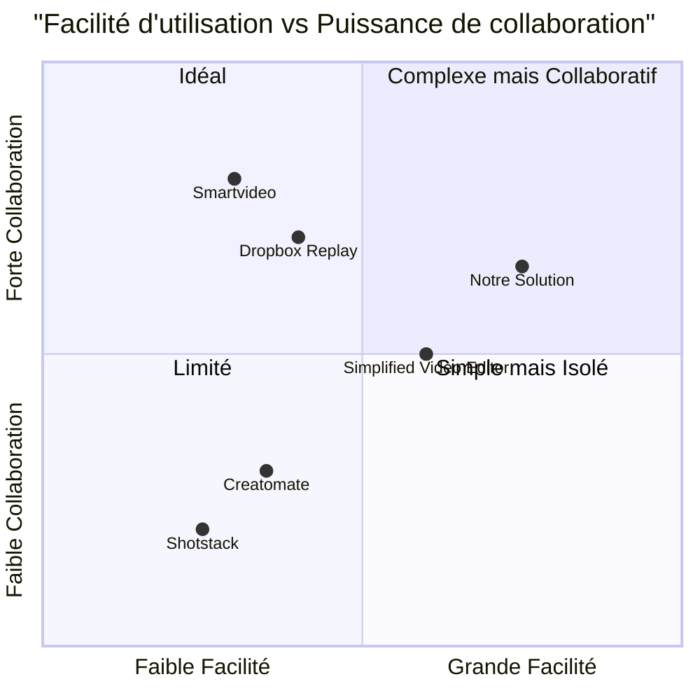

# PRD - Application de Montage Vidéo Collaboratif

## Informations du Projet

**Nom du Projet:** app_montage_video_collaboratif
**Langage de Programmation:** React, JavaScript, Tailwind CSS (via Next.js)
**Date de Création:** 12 juin 2025

## Résumé des Exigences Originales

Développer une application web (PWA) permettant :
- La création d'événements vidéo collaboratifs.
- L'invitation de participants à enregistrer/charger une courte vidéo.
- La génération automatique d'un montage final harmonisé.
- L'accès à la vidéo finale uniquement par l'organisateur.

## Définition du Produit

### Objectifs du Produit

1. **Simplifier la Création de Contenu Collaboratif** - Permettre à des groupes de créer facilement des vidéos collaboratives sans expertise technique en montage vidéo.
2. **Optimiser l'Expérience Utilisateur Mobile** - Offrir une expérience fluide et intuitive pour l'enregistrement et le partage de vidéos sur appareils mobiles.
3. **Automatiser le Processus de Montage** - Éliminer la complexité technique du montage vidéo en générant automatiquement une vidéo finale cohérente.

### User Stories

1. **En tant qu'organisateur d'événement**, je veux créer facilement un événement vidéo collaboratif avec un thème spécifique, afin de collecter des vidéos auprès de mes invités pour une occasion spéciale.
2. **En tant que participant**, je veux pouvoir enregistrer ou télécharger rapidement ma vidéo via un lien d'invitation, afin de contribuer facilement sans avoir besoin de créer un compte complet.
3. **En tant qu'organisateur**, je veux recevoir des notifications lorsque de nouvelles vidéos sont soumises, afin de suivre la progression de mon événement vidéo.
4. **En tant qu'organisateur**, je veux obtenir une vidéo finale montée automatiquement, afin d'économiser du temps et des compétences en édition vidéo.
5. **En tant que participant**, je veux pouvoir enregistrer ma vidéo directement depuis mon navigateur mobile, afin d'éviter de télécharger une application supplémentaire.

### Analyse Concurrentielle

| Produit | Forces | Faiblesses |
| --- | --- | --- |
| **Dropbox Replay** | - Commentaires précis sur la timeline<br>- Intégration avec des logiciels professionnels<br>- Révision en direct<br>- Accessible via navigateur | - Orienté révision plus que création collaborative<br>- Pas de génération automatique de montage<br>- Complexe pour utilisateurs non-techniques |
| **Simplified Video Editor** | - Interface intuitive<br>- Partage de liens d'aperçu<br>- Système de commentaires et tags | - Manque d'automatisation du montage<br>- Pas d'approche événementielle<br>- Nécessite un compte pour tous les participants |
| **Smartvideo** | - Centralisation des échanges<br>- Annotation précise<br>- Validation par étapes | - Orienté production professionnelle<br>- Courbe d'apprentissage importante<br>- Pas de génération automatique |
| **Creatomate** | - API de génération vidéo<br>- Automatisation via templates<br>- Intégrations IA | - Pas d'interface de collaboration<br>- Orienté marketing plus qu'événementiel<br>- Complexité technique |
| **Shotstack** | - Création automatique de vidéos<br>- Personnalisation avec données dynamiques<br>- Génération de sous-titres | - Orienté B2B et développeurs<br>- Pas d'interface accessible aux novices<br>- Pas d'aspect événementiel collaboratif |
| **Notre Solution** | - Approche événementielle simple<br>- Montage automatisé sans expertise<br>- Expérience participant optimisée<br>- Accès contrôlé à la vidéo finale | - Limitations sur la personnalisation<br>- Options de montage prédéfinies<br>- Durée limitée des vidéos |

### Quadrant Compétitif



## Spécifications Techniques

### Analyse des Besoins

L'application doit permettre une expérience utilisateur fluide pour deux types d'utilisateurs principaux : les organisateurs d'événements et les participants. Le processus central comprend la création d'événements, la collecte de vidéos et la génération automatique d'un montage final, le tout dans une interface accessible et intuitive.

Les besoins techniques identifiés sont :

1. **Architecture Progressive Web App (PWA)** - Pour assurer une expérience mobile optimale sans installation d'application native.
2. **Capacité d'enregistrement vidéo in-app** - Permettre aux participants d'enregistrer directement via le navigateur.
3. **Système d'authentification** - Sécuriser l'accès aux événements et aux vidéos finales.
4. **Stockage de vidéos** - Gérer le téléchargement et le stockage sécurisé des contenus vidéo.
5. **Traitement vidéo automatisé** - Générer des montages cohérents sans intervention manuelle.
6. **Système de notifications** - Informer les organisateurs des nouvelles soumissions.
7. **Interface de suivi** - Permettre aux organisateurs de suivre la progression des contributions.

### Matrice des Exigences

| ID | Exigence | Priorité | Description |
| --- | --- | --- | --- |
| **R1** | **Gestion des utilisateurs** | P0 | |
| R1.1 | Inscription utilisateur | P0 | L'utilisateur doit pouvoir créer un compte via email ou Google |
| R1.2 | Authentification | P0 | L'utilisateur doit pouvoir se connecter de façon sécurisée |
| R1.3 | Profil utilisateur | P1 | L'utilisateur doit pouvoir gérer ses informations personnelles |
| **R2** | **Gestion des événements** | P0 | |
| R2.1 | Création d'événement | P0 | L'organisateur doit pouvoir créer un événement vidéo avec paramètres |
| R2.2 | Invitation des participants | P0 | L'organisateur doit pouvoir partager un lien d'invitation |
| R2.3 | Suivi des contributions | P0 | L'organisateur doit pouvoir suivre les vidéos soumises en temps réel |
| R2.4 | Date limite automatique | P1 | L'événement doit se clôturer automatiquement à la date spécifiée |
| **R3** | **Gestion des vidéos** | P0 | |
| R3.1 | Enregistrement in-app | P0 | Le participant doit pouvoir enregistrer une vidéo via son navigateur |
| R3.2 | Upload de vidéo | P0 | Le participant doit pouvoir télécharger une vidéo existante |
| R3.3 | Validation de soumission | P0 | Le participant doit confirmer sa soumission finale |
| R3.4 | Restrictions format/durée | P0 | L'application doit limiter à 30 secondes et au format portrait 9:16 |
| **R4** | **Montage automatique** | P0 | |
| R4.1 | Déclenchement automatique | P0 | Le montage doit se lancer automatiquement quand toutes les vidéos sont reçues |
| R4.2 | Déclenchement manuel | P1 | L'organisateur doit pouvoir déclencher le montage manuellement |
| R4.3 | Notification de complétion | P0 | L'organisateur doit être notifié quand la vidéo finale est prête |
| **R5** | **Gestion de la vidéo finale** | P0 | |
| R5.1 | Accès restreint | P0 | Seul l'organisateur doit avoir accès à la vidéo finale |
| R5.2 | Téléchargement | P0 | L'organisateur doit pouvoir télécharger la vidéo finale |
| R5.3 | Partage externe | P1 | L'organisateur doit pouvoir partager la vidéo via un lien |
| **R6** | **Notifications** | P1 | |
| R6.1 | Notification par email | P1 | Envoi d'emails pour les nouvelles contributions et vidéo finale |
| R6.2 | Notifications in-app | P1 | Système de notifications dans l'application |
| **R7** | **Infrastructure technique** | P0 | |
| R7.1 | Architecture PWA | P0 | L'application doit fonctionner comme une PWA |
| R7.2 | Responsive design | P0 | L'interface doit s'adapter à tous les appareils (priorité mobile) |
| R7.3 | Stockage cloud sécurisé | P0 | Les vidéos doivent être stockées de façon sécurisée |

### Maquette d'Interface Utilisateur

L'application sera composée des écrans principaux suivants :

1. **Écran d'Accueil & Authentification**
   - Inscription/Connexion (email, Google)
   - Présentation du concept

2. **Dashboard Organisateur**
   - Liste des événements créés
   - Bouton "Nouvel événement"
   - Statut des événements (ouvert, en traitement, terminé)

3. **Création d'Événement**
   - Formulaire avec champs : titre, thème, nombre max de vidéos, date limite
   - Options de personnalisation du montage final
   - Bouton de génération du lien d'invitation

4. **Suivi d'Événement**
   - Liste des participants invités/ayant soumis une vidéo
   - Compteur de vidéos reçues/attendues
   - Prévisualisation des miniatures des vidéos reçues
   - Bouton pour déclencher manuellement le montage

5. **Page Participant**
   - Information sur l'événement
   - Interface d'enregistrement vidéo avec minuteur
   - Option d'upload de vidéo existante
   - Bouton de confirmation de soumission

6. **Vidéo Finale**
   - Lecteur vidéo pour la vidéo montée
   - Options de téléchargement
   - Options de partage

Maquette simplifiée de l'écran principal :

```
┌─────────────────────────────────────────────┐
│ App Montage Vidéo Collaboratif    👤 Profil │
├─────────────────────────────────────────────┤
│ ┌─────────────────────────────────────────┐ │
│ │          MES ÉVÉNEMENTS VIDÉO           │ │
│ └─────────────────────────────────────────┘ │
│                                             │
│ ┌─────────┐ ┌─────────┐ ┌─────────┐       │
│ │Anniv.   │ │Mariage  │ │         │       │
│ │Marie    │ │Sophie   │ │   +     │       │
│ │10/15    │ │En cours │ │Nouveau  │       │
│ │Terminé  │ │15/20    │ │         │       │
│ └─────────┘ └─────────┘ └─────────┘       │
│                                             │
│ ┌─────────────────────────────────────────┐ │
│ │          VIDÉOS FINALISÉES              │ │
│ └─────────────────────────────────────────┘ │
│                                             │
│ ┌─────────┐ ┌─────────┐                   │
│ │         │ │         │                   │
│ │ Anniv.  │ │ Départ  │                   │
│ │ Marie   │ │ Julien  │                   │
│ │         │ │         │                   │
│ └─────────┘ └─────────┘                   │
└─────────────────────────────────────────────┘
```

### Questions Ouvertes

1. **Personnalisation du montage** - Quel degré de personnalisation offrir à l'organisateur pour le montage final ? (transitions, musique, ordre des vidéos)

2. **Limites techniques** - Quelles sont les limites de taille et durée maximales supportées par l'application ? Comment gérer les différences de qualité entre les vidéos soumises ?

3. **Options de monétisation** - Envisager un modèle freemium avec limite du nombre d'événements ou de participants dans la version gratuite ?

4. **Évolution future** - Prévoir l'intégration de fonctionnalités d'édition manuelle pour les organisateurs souhaitant plus de contrôle sur le montage final ?

5. **Sécurité et confidentialité** - Comment garantir que les vidéos ne seront pas accessibles à des personnes non autorisées ? Quelle politique de conservation des données implémenter ?

## Plan d'Implémentation

### Phase 1 - MVP (Produit Minimum Viable)

- Authentification utilisateur (email + Google)
- Création d'événement basique
- Génération de liens d'invitation
- Upload/enregistrement vidéo format portrait
- Montage automatique basique (bout à bout)
- Accès organisateur à la vidéo finale

### Phase 2 - Enrichissement

- Système de notifications avancé
- Options de personnalisation du montage
- Interface de suivi améliorée
- Partage externe des vidéos finales
- Support de formats vidéo supplémentaires

### Phase 3 - Évolution

- Édition manuelle optionnelle
- Templates de montage thématiques
- Intégration de musiques et transitions
- Analytics et statistiques d'événements
- Options de monétisation premium

## Conclusion

L'Application de Montage Vidéo Collaboratif répond à un besoin croissant de création vidéo simplifiée et collaborative, particulièrement adapté aux événements sociaux et professionnels. La combinaison d'une interface intuitive, d'un processus d'invitation simple et d'un montage automatisé offre une valeur unique par rapport aux solutions existantes sur le marché.

L'approche PWA avec Next.js et Supabase permet un développement rapide et une expérience utilisateur optimisée sur tous les appareils, en particulier sur mobile où la majorité des vidéos seront capturées.

Le succès du produit reposera sur sa simplicité d'utilisation, la qualité des montages automatiques générés et la fluidité du processus de soumission pour les participants.