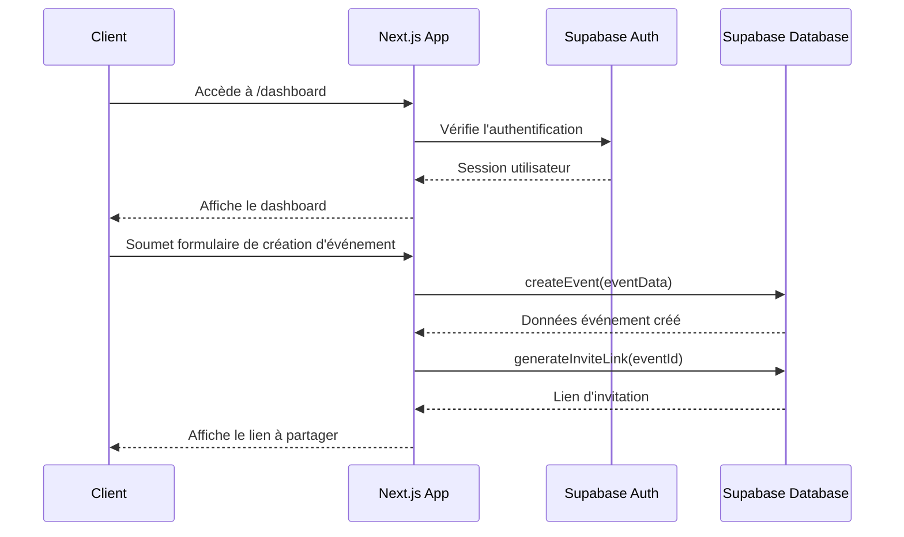
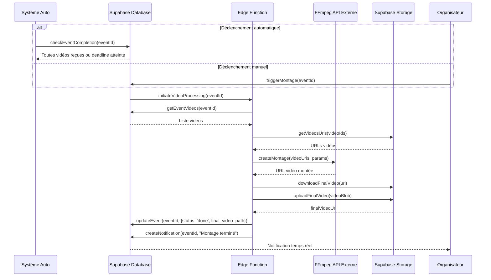
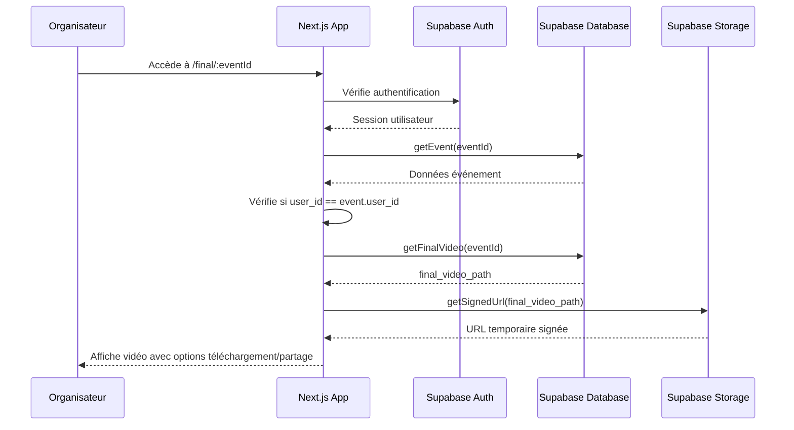

# Architecture Système - Application de Montage Vidéo Collaboratif

## Implementation approach

### 1. Analyse des Points Techniques Critiques

L'application présente plusieurs défis techniques spécifiques :

1. **Traitement vidéo automatisé** - Besoin d'un service robuste pour le montage automatique des vidéos
2. **Stockage et gestion des vidéos** - Gestion efficace du stockage et des accès aux fichiers volumineux
3. **Expérience PWA fluide** - Nécessité d'une architecture optimisée pour mobile avec fonctionnalités offline
4. **Enregistrement vidéo in-browser** - Implémentation fiable de l'API MediaRecorder sur différents appareils
5. **Authentification multi-méthodes** - Gestion sécurisée des différents flux d'authentification

### 2. Choix des Technologies

#### Frontend
- **Next.js 14 (App Router)** - Pour le routage côté serveur et les composants React
- **Tailwind CSS** - Pour le design responsive et l'UI
- **Workbox** - Pour la configuration PWA (service workers, manifest)
- **MediaRecorder API** - Pour l'enregistrement vidéo natif
- **@supabase/auth-helpers-nextjs** - Pour l'intégration de l'authentification

#### Backend
- **Supabase** - Pour la gestion de la base de données, l'authentification et le stockage
  - **Auth** - Email + OAuth Google
  - **Storage** - Gestion des fichiers vidéo
  - **Database** - Tables PostgreSQL
  - **Realtime** - Pour les mises à jour en temps réel
  - **Edge Functions** - Pour le traitement asynchrone

#### Traitement Vidéo
- **FFmpeg API externe** (comme Shotstack ou Creatomate) - Pour le montage automatique
- **FFmpeg.wasm** - Pour les traitements légers côté client (compression, prévisualisation)

### 3. Architecture Globale

Nous adopterons une architecture JAMstack avec Next.js et Supabase :

1. **Architecture Client-Serverless** :
   - Next.js pour le rendu côté client et serveur
   - Supabase pour les services backend sans serveur
   - Edge Functions pour le traitement asynchrone

2. **Flux de Données** :
   - Authentification via Supabase Auth
   - Données structurelles stockées dans la base PostgreSQL
   - Fichiers vidéo stockés dans Supabase Storage
   - Notifications en temps réel via Supabase Realtime

3. **Traitement Vidéo** :
   - Upload/enregistrement initial avec compression client-side
   - Stockage temporaire dans Supabase Storage
   - Déclenchement du montage via Edge Function
   - Utilisation d'une API FFmpeg externe pour le montage
   - Stockage de la vidéo finale dans Supabase Storage

## Data structures and interfaces

Voici les principales structures de données et interfaces de l'application :

```typescript
// Modèles de données principaux
interface User {
  id: string;
  email: string;
  name: string;
  avatar_url?: string;
  created_at: Date;
}

interface Event {
  id: string;
  user_id: string;
  title: string;
  theme?: string;
  deadline: Date;
  max_videos: number;
  status: 'open' | 'processing' | 'done';
  created_at: Date;
  final_video_path?: string;
}

interface Video {
  id: string;
  event_id: string;
  user_id: string;
  participant_name: string;
  storage_path: string;
  duration: number;
  status: 'uploading' | 'processing' | 'ready' | 'error';
  created_at: Date;
}

interface Notification {
  id: string;
  event_id: string;
  user_id: string;
  message: string;
  read: boolean;
  created_at: Date;
}

// Services et Interfaces
interface AuthService {
  signUp(email: string, password: string): Promise<User>;
  signIn(email: string, password: string): Promise<User>;
  signInWithGoogle(): Promise<User>;
  signOut(): Promise<void>;
  getCurrentUser(): Promise<User | null>;
}

interface EventService {
  createEvent(data: Partial<Event>): Promise<Event>;
  getEvent(id: string): Promise<Event>;
  getUserEvents(userId: string): Promise<Event[]>;
  updateEvent(id: string, data: Partial<Event>): Promise<Event>;
  generateInviteLink(eventId: string): string;
  triggerMontage(eventId: string): Promise<void>;
}

interface VideoService {
  uploadVideo(eventId: string, file: File, participantName: string): Promise<Video>;
  recordVideo(eventId: string, stream: MediaStream, participantName: string): Promise<Video>;
  getEventVideos(eventId: string): Promise<Video[]>;
  getFinalVideo(eventId: string): Promise<string>;
}

interface NotificationService {
  createNotification(eventId: string, userId: string, message: string): Promise<Notification>;
  getUserNotifications(userId: string): Promise<Notification[]>;
  markAsRead(notificationId: string): Promise<void>;
  subscribeToEventUpdates(eventId: string, callback: (update: any) => void): () => void;
}

interface VideoProcessingService {
  compressVideo(file: File): Promise<File>;
  validateVideoFormat(file: File): Promise<boolean>;
  generateThumbnail(videoPath: string): Promise<string>;
  createMontage(videoIds: string[], eventId: string): Promise<string>;
}
```

## Program call flow

Voici les principaux flux d'appels de programme pour les fonctionnalités clés :

### 1. Création d'un événement et invitation des participants



### 2. Soumission d'une vidéo par un participant

```mermaid
sequenceDiagram
    participant Participant
    participant NextApp as Next.js App
    participant MediaRec as MediaRecorder API
    participant SupaStorage as Supabase Storage
    participant SupaDB as Supabase Database
    participant EventOrg as Organisateur Événement
    
    Participant->>NextApp: Accède au lien d'invitation
    NextApp->>SupaDB: getEvent(eventId)
    SupaDB-->>NextApp: Données événement
    NextApp-->>Participant: Affiche page soumission
    
    alt Enregistrement vidéo
        Participant->>NextApp: Clique "Enregistrer"
        NextApp->>MediaRec: Demande accès caméra
        MediaRec-->>Participant: Demande permission
        Participant-->>MediaRec: Accorde permission
        MediaRec->>NextApp: Stream vidéo actif
        Participant->>NextApp: Commence enregistrement
        NextApp->>MediaRec: startRecording()
        Participant->>NextApp: Arrête enregistrement
        NextApp->>MediaRec: stopRecording()
        MediaRec-->>NextApp: Blob vidéo
    else Upload vidéo existante
        Participant->>NextApp: Sélectionne fichier vidéo
        NextApp->>NextApp: validateVideoFormat(file)
    end
    
    NextApp->>NextApp: compressVideo(videoBlob)
    NextApp->>SupaStorage: uploadVideo(videoBlob)
    SupaStorage-->>NextApp: URL stockage
    NextApp->>SupaDB: createVideo(eventId, url, participantName)
    SupaDB-->>NextApp: Confirmation
    NextApp->>SupaDB: createNotification(eventId, "Nouvelle vidéo")
    SupaDB-->>EventOrg: Notification temps réel
    NextApp-->>Participant: Confirmation soumission
```

### 3. Génération automatique du montage vidéo



### 4. Accès à la vidéo finale par l'organisateur



## Anything UNCLEAR

1. **Integration FFmpeg API externe** : La PRD mentionne l'utilisation d'une API FFmpeg externe mais ne spécifie pas laquelle (Shotstack, Creatomate, etc.). Le choix spécifique affectera l'implémentation des fonctions de montage. Il serait utile de sélectionner une API spécifique ou de prévoir une abstraction permettant de changer facilement.

2. **Niveau de personnalisation du montage** : Le PRD liste comme question ouverte le degré de personnalisation à offrir pour le montage. Pour l'architecture initiale, nous avons prévu une personnalisation minimale (ordre des vidéos, transitions basiques), mais l'interface pourrait nécessiter des ajustements selon les décisions finales.

3. **Gestion des erreurs de traitement vidéo** : Il faudrait clarifier comment gérer les cas où une vidéo ne peut pas être traitée (format incompatible découvert après upload, erreur pendant le montage, etc.).

4. **Stockage à long terme** : La politique de conservation des données n'est pas clairement définie. Faut-il prévoir une suppression automatique des vidéos sources après une certaine période pour économiser de l'espace de stockage ?

5. **Limites techniques précises** : Bien que le PRD mentionne une limite de 30 secondes pour les vidéos, il faudrait préciser les limites exactes de taille de fichier à imposer et la résolution maximale acceptée.